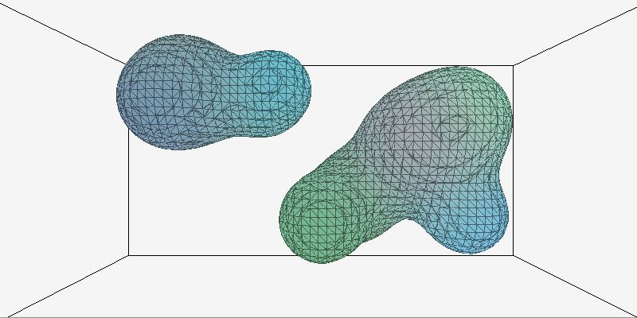

# Metaballs



Header only 3d metaballs generator in C99

## About

[](https://github.com/casensiom/metaballs/actions)

This library computes 3d metaballs in pure C99.


There are optimizations yet to be done.

The example uses [raylib](https://www.raylib.com) as a render engine.

## How to use

This library follows [single-file C/C++ public domain libraries](https://github.com/nothings/single_file_libs) rules.

Include the header file and the definition to include the implementation code in just one of the includes.

```c
#define METABALLS_IMPLEMENTATION
#include "metaballs.h"
``` 

Refer the [examples](https://github.com/casensiom/metaballs/examples/exmaple0.c) to see the library usage.

### Create

Creates the metaballs workspace
```c
Index3d count = {.x = 10, .y = 10, .z = 10};
Vector3d size = {.x = 2, .y = 2, .z = 2};
Vector3d pos = {.x = 0, .y = 0, .z = 0};
Grid grid = metaball_grid_create(count, size, pos);
```

### Generate mesh
Builds up the mesh to render the metaballs
```c
metaball_generate_mesh(&grid, balls);
```

### Destroy
Destroys the metaballs workspace
```c
metaball_grid_destroy(&grid);
```

## Features
- **Iteration**: Added a method to visit only valid neighbors.
- **Optimization**: A rudimentary cache system is included.
- **Color**: Added color per ball.
- **Texture mapping**: Generate and upload mesh to GPU, texture mapping is available.
- **Control**: Added mouse and keyboard control.

## TODO
 - Code clean: Add prefix to library methods and structures. (Avoid name collision)
 - Known issue: The spheric texture mapping doesn't close correctly.
 - Performance: Avoid repeat vertex on mesh generation.
