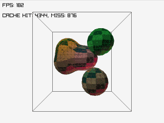

# Metaballs

## Description

This proyect computes metaballs in pure C, using raylib to render it.

There are optimizations to be done.

## Features
- **Iteration**: Added a method to visit only valid neighbors.
- **Optimization**: A rudimentary cache system is included.
- **Color**: Added color per ball.
- **Texture mapping**: Generate and upload mesh to GPU, texture mapping is available.
- **Control**: Added mouse and keyboard control.

## TODO

  - Known issue. The spheric texture mapping doesn't close correctly.
