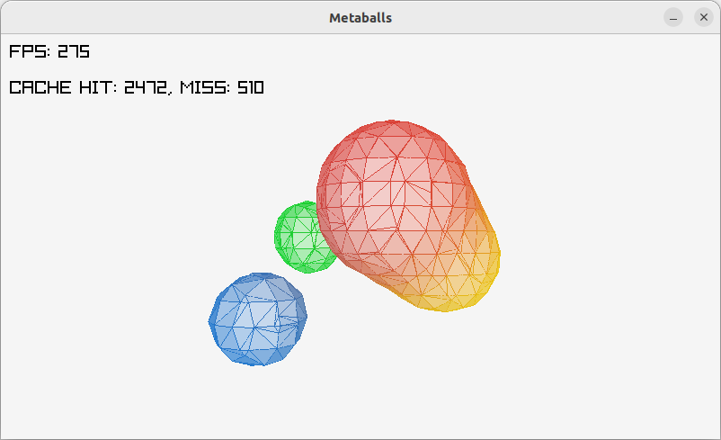

# Metaballs

## Description

This proyect builds a metaball in pure C, uses raylib to render it.

There are optimizations to be done.

## TODO

 - ~~Iteration~~. Added a method to visit only valid neighbors.
 - ~~Compute the edge values only once~~. A rudimentary cache system is included.
 - ~~Add color~~. Added color per ball.
 - Add texture mapping.
 - Clean code, separate voxel calculation and render code.
 - Control, add mouse and keyboard control.
